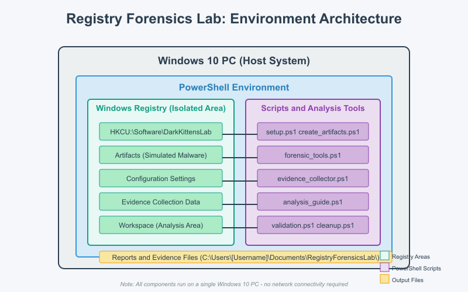

# Registry Forensics Lab: Tracking the Dark Kittens

## Background Story

The notorious hacking group Dark Kittens has struck again! Globomantics, an international conglomerate that runs an artificial island in the Gulf of Mexico for their "ideal society" experiment, has detected unusual activity on one of their administrator workstations. Their security team has reason to believe that the Dark Kittens have compromised the system and are using Windows Registry modifications to maintain persistence.
As a security engineer contracted by Globomantics, your mission is to investigate the compromised system's registry for evidence of the attack, identify the persistence mechanisms being used, and collect forensic evidence that could help track down the attackers.

This lab focuses on Windows Registry forensics, providing a safe environment to learn and practice identifying common registry-based persistence techniques used by attackers.

## Important Safety Note
This lab has been designed to be completely safe for your host system. All registry modifications are contained to a dedicated test key under HKCU\Software\DarkKittensLab, which will not affect system operations. The cleanup script will remove all test registry keys created during the lab.

## Lab Environment

This lab is designed to run entirely on a Windows system with PowerShell, without requiring any virtual machines or cloud resources. The lab creates a safe, isolated testing environment within the Windows Registry that simulates a compromised system without affecting your actual system's security or stability.

## Prerequisites

- Windows 8, 10 Home (or any edition) or later version of Windows
- PowerShell 5.1 or later
- Administrator access to your local machine

## Network Diagram

This lab runs entirely on your local machine and does not require any network connections. The environment is contained within a dedicated registry key (`HKCU:\Software\DarkKittensLab`) that simulates various registry artifacts of a compromised system.

## Lab Files

1. `README.md` - This file with lab instructions and overview
2. `setup.ps1` - Sets up the safe testing environment
3. `create_artifacts.ps1` - Creates simulated malicious registry artifacts
4. `persistence_simulator.ps1` - Explains common registry persistence techniques
5. `forensic_tools.ps1` - Provides tools for registry analysis
6. `registry_diff.ps1` - Compares registry states to identify changes
7. `evidence_collector.ps1` - Collects and documents registry findings
8. `cleanup.ps1` - Removes all test registry keys
9. `analysis_guide.ps1` - Provides guided analysis steps
10. `validation.ps1` - Validates findings and progress
11. `LAB_EXERCISES.md` - Detailed exercise guide with specific tasks
12. `terraform/main.tf` - Infrastructure definition for cloud deployment
13. `terraform/variables.tf` - Variables for Terraform configuration
14. `terraform/security.tf` - Security group and IAM configurations
15. `terraform/outputs.tf` - Outputs from Terraform deployment
16. `terraform/security_improvements.tf` - File for learners to add security enhancements

## Learning Objectives

By completing this lab, you will:

1. Understand common registry-based persistence techniques used by attackers
2. Learn to identify suspicious registry keys and values
3. Practice using PowerShell for registry forensic analysis
4. Develop skills in evidence collection and documentation
5. Experience the process of investigating a compromised system
6. Create and document your own simulated malicious registry entries
7. Generate professional incident response reports
8. Apply critical thinking to security analysis scenarios
9. Develop skills in differential registry analysis
10. Practice manual investigation techniques essential for real-world forensics

## Troubleshooting Common Issues

- **PowerShell Execution Issues**: If scripts won't run, make sure you've set the execution policy and are running as Administrator
- **Registry Access Errors**: Ensure you're running with Administrator privileges
- **Missing Artifacts**: If artifacts aren't appearing, confirm you ran setup.ps1 before other scripts
- **Report Generation Problems**: Make sure you've collected at least 3 pieces of evidence before generating a report
- **Terraform Review Validation**: If validation.ps1 keeps failing, check that you've created terraform/review_answers.txt with answers to all questions

For any other issues, refer to the LAB_EXERCISES.md file for more detailed instructions on each task.

## Safety Considerations

This lab has been designed to be completely safe for your host system. All registry modifications are contained to a dedicated test key under `HKCU:\Software\DarkKittensLab`, which will not affect system operations. The cleanup script will remove all test registry keys created during the lab.

## Expected Completion Time

The lab is designed to take approximately 25-30 minutes to complete once the environment is set up. However, you can spend additional time exploring the simulated artifacts and learning about registry-based persistence techniques.

## Success Criteria

You will successfully complete this lab when you can:

1. Identify at least 5 different registry-based persistence mechanisms
2. Document the registry paths and values associated with each technique
3. Explain how each technique works to maintain persistence
4. Generate a comprehensive forensic report of your findings

## Support

If you encounter any issues with the lab, please check the following:

1. Ensure you're running PowerShell as Administrator
2. Verify that all the lab files are in the same directory
3. Make sure you run the scripts in the recommended order

Good luck, security analyst! Globomantics is counting on you to uncover the Dark Kittens' secrets.
